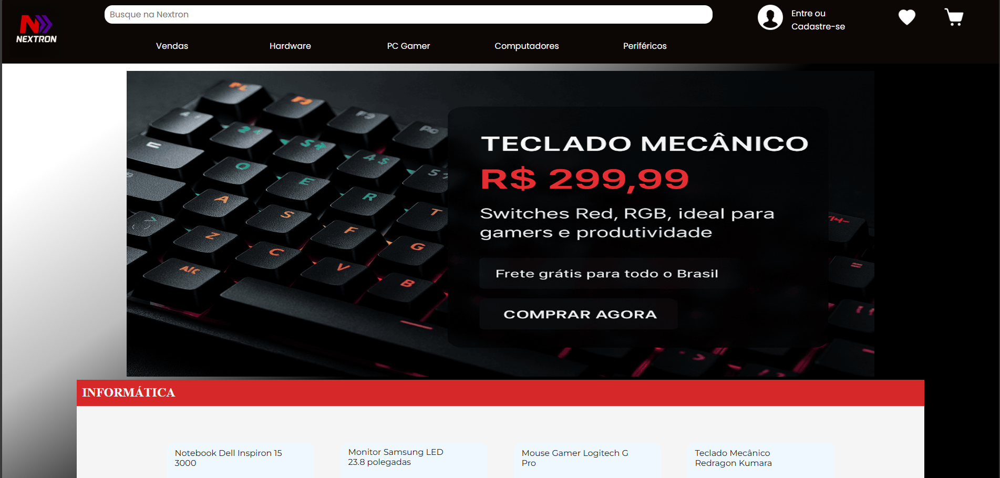
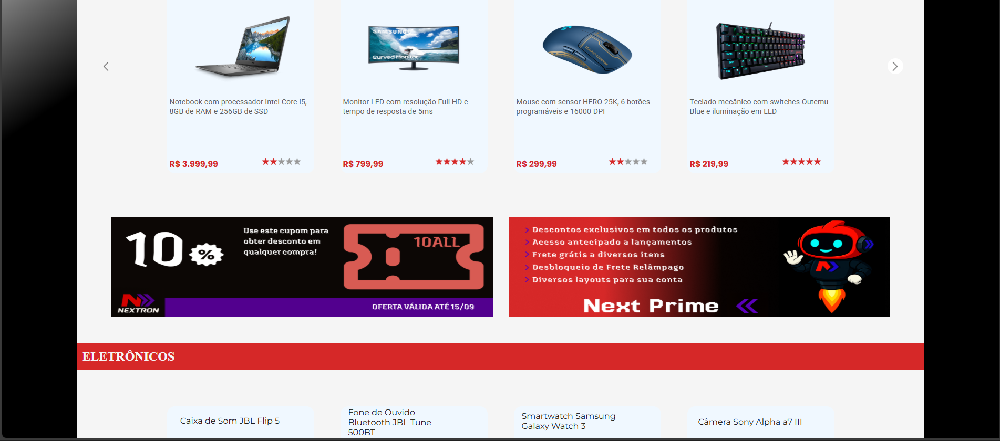
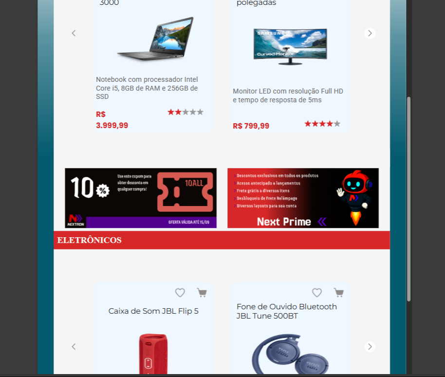
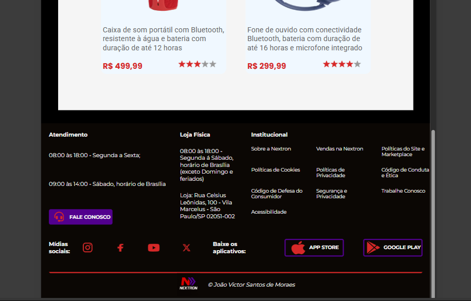
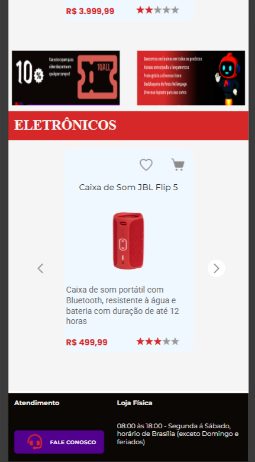
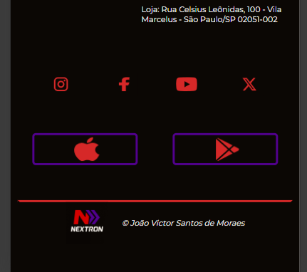

# Loja online Nextron

Site promocional de uma empresa de venda de eletrônicos chamada Nextron.

## Layout para Desktop

.png)

## Layout para Tablet

## Layout para Mobile

Foi implementado um carrossel de imagens no início do site. Dê uma olhada no [carrossel](https://joaomoraes28.github.io/Loja_Virtual/). 
O site possui diversas funções feitas com CSS e JS, como por exemplo:

* Sistema de adicionar e visualizar produto nos favoritos 
* Sistema de adicionar e visualizar produto no carrinho
* Troca de cards
* Animações em links, botões e cards

## Tecnologias
* HTML
* CSS
* JavaScript
* Figma

## Autor
João Victor Santos de Moraes